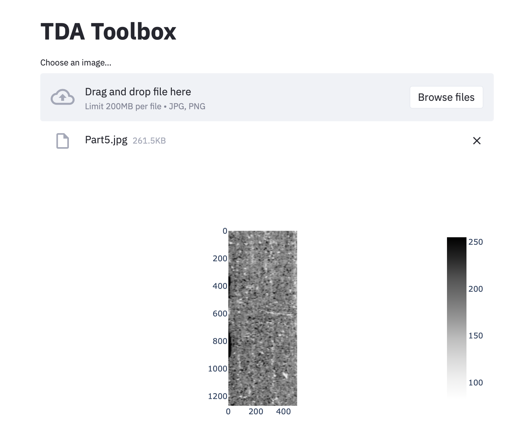
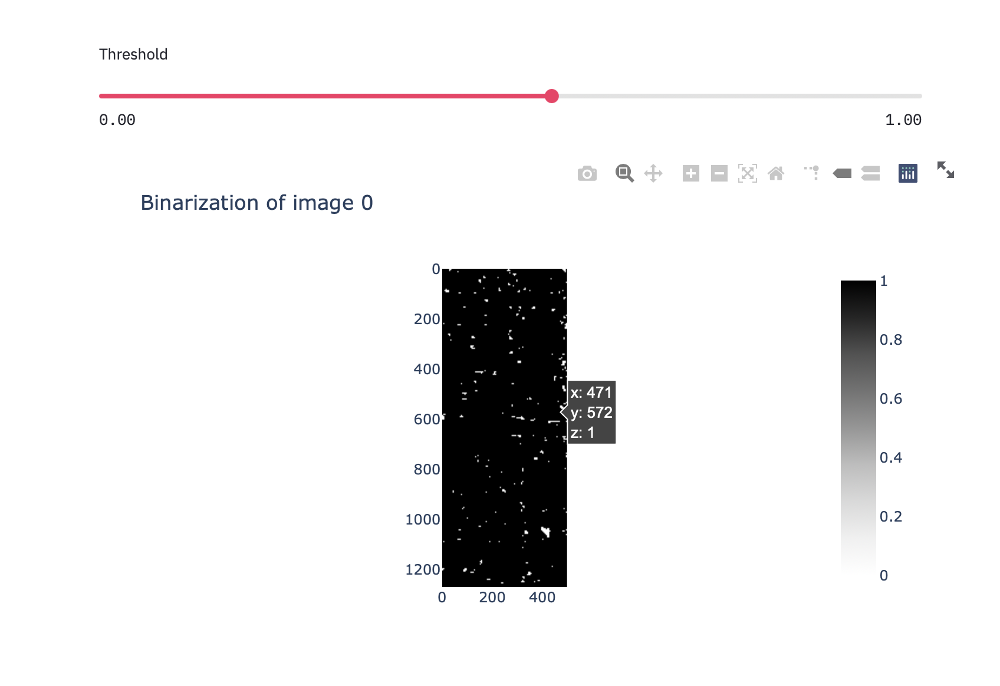

# Topological Data Analysis Toolbox

Toolbox of useful visualistions for applying TDA to images. Uses streamlit to give easy access to the giotto-tda library.

## Installation

### Docker

Project can be run as a docker container. Build using

```
docker build -t tda-toolbox .
```

Then run with

```
docker run -p 8501:8501 tda-toolbox
```

The application can then be accessed by going to [localhost:8501](http://localhost:8501) in a browser.

## Usage

An example of the various images that can be created using the application. Changing parameters earlier in the pipeline will cause later images to be regenerated.

### Choose File

Upload a PNG or JPEG image.


### Binarization

Convert the image to only black and white pixels. Adjust the slider to change the threshold.



### Filtration

Choose from one of the available filtrations and adjust any parameters.


### Cubical Persitence

View the cubical persistence diagram for the chosen filtration.


### Heat Kernel

View the Heat kernel for the Cubical Persistence diagram.


